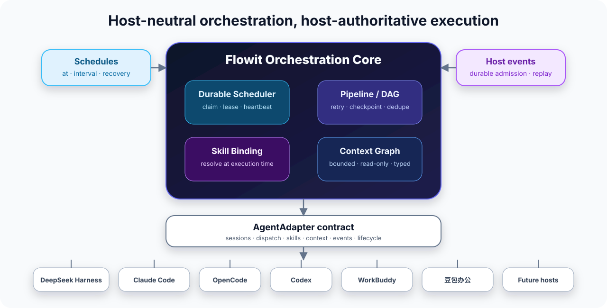

<div align="center">


<br />

[](https://github.com/Andrewlislin/Flowit-Workflow/actions/workflows/ci.yml)
[](LICENSE)
[](package.json)
[](https://github.com/Andrewlislin/Flowit-Workflow/releases/tag/v0.5.0-beta.1)

# Flowit Workflow · 浮域

**Turn the AI agents you already use from one-shot assistants into durable, role-based, recoverable, scheduled workflows.**

A **CoaseEdge / 高斯边界** product.

[中文（默认）](README.md) · **English** · [Setup & Repair](docs/setup.md) · [Built-in Work Modes](docs/presets.md) · [Architecture](docs/architecture.md)

</div>

---

## What is Flowit?

WorkBuddy, Claude Code, Codex, OpenCode, DeepSeek Harness, Doubao Office and similar agents are already good at doing a task when you ask them.

Flowit solves a different problem: **how to keep those agents doing a repeatable, multi-step job reliably over time.**

A single agent usually looks like this:

```text
You
 ↓
Agent
 ↓
One task
 ↓
Result
```

With Flowit, the same work can become:

```text
Schedule / event / manual start
            ↓
          Plan
            ↓
         Research
            ↓
         Execute
            ↓
         Review
            ↓
      Human approval
```

Flowit keeps track of when work should run, which Session owns each stage, which Skills are required, what context may cross boundaries, which stages are complete, and where recovery should resume after a failure.

It does **not** replace host authentication, model configuration, permissions, sandboxes, workspace trust or tool approvals. The selected agent still performs the actual work.

## Why not just use one agent directly?

For a quick email rewrite, one PDF summary, one small function or a tiny bug fix, directly using WorkBuddy, Claude Code or Codex is usually simpler.

Flowit becomes more useful when the job is repeated, long-lived, review-heavy or shared across multiple agents.

| Agent alone | Flowit + Agent |
| --- | --- |
| “Do this now” | “Keep doing this workflow” |
| One long prompt | Explicit stages and checkpoints |
| You remember when to trigger it | Durable scheduling |
| One Session often owns everything | One or many Sessions can divide roles |
| A failure may require re-explaining context | Completed stages and run state persist |
| The process lives inside prompts | The process becomes a reusable Pipeline / Preset |
| The same agent writes and reviews | Execution and Review can be separated |
| Switching hosts often means rewriting prompts | The same business flow can bind to different hosts |

A simple rule:

> **AI helps me do one thing → use the agent directly.**  
> **AI should keep operating a repeatable process → use Flowit.**

## Four core advantages

### Natural-language setup

Ordinary users do not need to memorize CLI syntax. The recommended path is to ask the current agent to inspect, install, repair and verify Flowit.

> Install the latest beta of Flowit Workflow and integrate it with the agent you are running in. First inspect my environment and existing configuration. Do not modify anything yet. Show me what files and permissions you plan to change, wait for my approval, then install it and run a health check. If any host-native UI step is still required, explain it in simple language.

The setup framework plans first, requires confirmation, then applies changes. Conflicting configuration fails closed instead of being silently overwritten.

### Multi-agent collaboration

One business workflow can divide work by role:

```text
WorkBuddy
Web / office collection
        ↓
Claude Code
Deep analysis
        ↓
Codex
Technical review
        ↓
WorkBuddy
Management report
```

You can also bind every role to one Session. Flowit supports both “one agent working in explicit stages” and “multiple agents working like a team.”

### Recoverable execution

Long jobs can fail because of network issues, host restarts or temporary agent failures. Flowit persists pipelines, node checkpoints, retries, leases and durable state.

The user-facing difference is simple: **resume from the unfinished stage instead of explaining the whole task again.**

### Scheduled automation

Flowit supports manual, daily, weekday and fixed-interval durable schedules. Users can simply say:

> Run this every day at 8:00 AM.

> Run this every weekday at 9:30 AM.

> Check every two hours.

The schedule belongs to Flowit’s durable state; it does not depend on the agent remembering to do something tomorrow.

## The easiest way to start: talk to your agent

After setup, users can continue with natural language:

> Show me the workflows Flowit currently knows about.

> Create a Deep Research workflow using this Session.

> Run the “authentication refactor” workflow now.

> Change the “industry daily” workflow to run every weekday at 8:00 AM.

Flowit MCP exposes Session discovery, Pipeline creation/execution, Schedule management and daemon startup, so an authorized host agent can translate those requests into durable workflow operations.

<details>
<summary><strong>Advanced users: install the beta directly</strong></summary>

Requires Node.js `^22.19.0` or `>=24.0.0`.

```bash
npx @coaseedge/flowit-workflow@beta setup
```

The stable technical identifiers remain:

```text
npm: @coaseedge/flowit-workflow
CLI: flowit-workflow
```

</details>

## How setup and usage differ by host

### WorkBuddy: a strong entry point for office automation

Ask WorkBuddy:

> Install Flowit for the current WorkBuddy environment. Preserve my existing MCP servers, Skills and Hooks. Show me the plan first, apply it only after I approve it, then run a health check.

Flowit configures four machine-side layers:

```text
Flowit MCP
+
Bridge Worker Skill
+
WorkBuddy lifecycle Hooks
+
Durable Bridge directories
```

**WorkBuddy Desktop still requires one host-native UI action:** create a WorkBuddy Automation that periodically invokes the **Flowit Workflow Bridge Worker** Skill. Think of it as an inbox worker that checks whether Flowit has new tasks.

Managed Driver deployments do not need this desktop polling step.

Typical scenario:

> Create an “industry daily” workflow in Flowit. Run it every weekday at 8:00 AM. Track AI, enterprise software and intelligent-office news. Find current signals, select the important items, research background, fact-check them and generate a Chinese management summary. Do not publish externally.

This maps naturally to **Content Studio / 内容工作室**.

### Claude Code: technical research, long documents and large coding jobs

Ask Claude Code:

> Install Flowit in the current Claude Code environment. Do not scatter changes across unrelated settings. Show me the setup plan first, install after approval, reload the plugin and verify the integration.

Flowit uses Claude Code’s skills-directory plugin model. Personal scope is installed under:

```text
~/.claude/skills/flowit-workflow/
```

The plugin bundles Flowit Skills, Hooks and MCP. Project scope is also supported; Claude’s own workspace-trust and MCP approval gates remain authoritative.

Typical scenario:

> Research whether this system should migrate to an event-driven architecture. Plan the question, gather primary evidence, deliberately search for counter-evidence, then synthesize conclusions and limitations. Do not only argue for the migration.

This maps naturally to **Deep Research / 深度研究**.

### Codex: implementation, testing and independent review

Ask Codex:

> Configure Flowit for this Codex environment. Do not rewrite my config.toml. Preserve my model, sandbox, comments and other MCP servers. If a same-name unmanaged configuration already exists, stop and explain the conflict.

Flowit manages only its own Codex MCP block and does not reserialize the entire TOML document.

Typical scenario:

> Use Flowit to handle this complex issue. First analyze requirements and affected code, then plan, implement, test and run an independent Review stage. List blocking review findings clearly. Do not merge automatically.

This maps naturally to **AI Project Team / AI 项目小组**.

### OpenCode V2: for existing OpenCode development environments

Ask OpenCode:

> Install Flowit, preserving my JSONC comments, models, agents and other MCP servers. After setup, check whether the OpenCode Server is reachable.

Flowit changes only its own `mcp.servers.flowit-workflow` entry.

Flowit does **not** silently launch an unmanaged OpenCode background process. If the server is not running, Doctor reports the explicit Serve/Server step.

Typical scenario:

> Every night, inspect dependencies, failing tests, obvious technical debt and TODO risk. Do not modify code; generate a report, then use a second stage to challenge the first stage’s conclusions.

### DeepSeek Harness: long-running agent systems

DSH is different from MCP-centric hosts. Flowit integrates through the native Cordis plugin / patch model.

Ask the Harness agent:

> Install the native Flowit plugin. Inspect the current Harness configuration first, preserve unrelated Cordis plugins, then tell me whether a restart is required.

User scope installs into the persistent home patch. Project scope uses an explicit project overlay because Harness currently has no project-local persistent patch layer.

Typical scenario:

> Research the 20 technical projects we track every day. When a major version change appears, investigate it further. For every project, gather evidence, search for counter-evidence and preserve historical conclusions.

### Doubao Office: GUI + Bridge office workflows

Doubao Office uses Flowit Bridge v2. Flowit does not pretend the host exposes stable public APIs for Session Resume, Skill installation or Automation management when those APIs are not documented.

After machine-side setup, the user completes these host-native UI steps:

```text
Import / enable Flowit Worker Skill
          ↓
Authorize the Flowit Bridge directory
          ↓
Create a recurring Doubao task that invokes the Worker
```

Typical scenario:

> Every weekday at 5:30 PM, summarize today’s project documents, meeting notes and tasks. Output completed work, unfinished work, tomorrow’s priorities and risks. Generate the report only; do not send it automatically.

## Three built-in work modes

Users do not need to memorize Preset IDs. Chinese UI surfaces use the product names below while stable internal IDs remain compatible.

| Work mode | Best for | Stable ID |
| --- | --- | --- |
| **Content Studio / 内容工作室** | News, industry content, daily reports, article drafts | `content-studio` |
| **Deep Research / 深度研究** | Market, technical, competitor and policy research | `research-lab` |
| **AI Project Team / AI 项目小组** | Coding, migration, complex plans and multi-step execution | `agent-team` |

### Content Studio

```text
Discover signals
      ↓
Choose topic
      ↓
Research evidence
      ↓
Write
      ↓
Fact-check
      ↓
Chief edit
```

The workflow ends at a human-reviewable final artifact and **does not publish externally by default**.

### Deep Research

```text
Frame question
      ↓
Gather evidence
      ↓
Find counter-evidence
      ↓
Synthesize
      ↓
Review
```

The workflow emphasizes primary evidence, opposing evidence, uncertainty and traceability.

### AI Project Team

```text
Plan
 ↓
Research
 ↓
Execute
 ↓
Review
```

Useful for large issues, refactors, migration plans and complex office work.

## Representative office scenarios

### Daily industry briefing

```text
Weekday 08:00
     ↓
Discover signals
     ↓
Select important items
     ↓
Deep research
     ↓
Write + fact-check
     ↓
Final management summary
```

### Weekly competitor research

```text
Research plan
    ↓
Collect evidence for A / B / C
    ↓
Counter-evidence and gaps
    ↓
Compare products / funding / hiring / marketing
    ↓
Conclusions, risks, opportunities and next-week watchlist
```

### Project-day summary

WorkBuddy or Doubao Office can summarize documents, meeting notes, tasks and risks at a fixed time, stopping at a human-reviewable result.

## Representative coding scenarios

### Large issue / module refactor

```text
Planner
Goals and constraints
      ↓
Researcher
Code and dependencies
      ↓
Executor
Implementation and tests
      ↓
Reviewer
Independent blocking review
      ↓
Human approval
```

For a two-minute fix, direct Codex is simpler. For a 30–60 minute multi-stage job that must recover and be reviewed, Flowit has more value.

### Nightly code-health report

Run dependency, failing-test, TODO, technical-debt and risk checks every night, producing a report without automatically modifying production code.

## Cross-agent workflows

Presets can bind roles to different hosts and Sessions:

```text
WorkBuddy
Web / GUI work
      ↓
Claude Code
Deep analysis
      ↓
Codex
Code and technical review
      ↓
WorkBuddy
Management summary
```

DeepSeek Harness currently uses an embedded Flowit Core/store. Mixed DSH and root-daemon hosts inside one Preset fail closed rather than pretending an unreliable topology is supported.

## Safety boundaries

Flowit improves **reliability, organization, repeatability and recovery**. It does not make the underlying model intrinsically smarter.

Important boundaries:

- host authentication, permissions, sandboxes, workspace trust and approvals remain host-authoritative;
- setup uses plan → confirmation → apply and stops on conflicting ownership;
- installing a Preset does not immediately execute agent work;
- Content Studio does not publish automatically;
- Bridge history and durable state are conservatively retained on uninstall;
- Flowit uses **at-least-once execution**, not generic exactly-once external side effects.

For email sending, publishing, deletion or production deployment, prefer human approval or host-native idempotency.

## Architecture



The Core stores orchestration facts and references. Host adapters translate those facts into host-native Session, Skill, Context, Event and lifecycle operations.

```text
Schedule / Host Event
        ↓
Durable admission
        ↓
Pipeline / Work Graph
        ↓
Checkpoint / Retry / Lease
        ↓
Host Adapter
        ↓
WorkBuddy / Claude Code / Codex / OpenCode / DSH / Doubao Office
```

### Host support

| Host | Integration | Notes |
| --- | --- | --- |
| DeepSeek Harness | Reference / Native | Cordis Plugin, Session, Skill and events |
| Claude Code | Pilot | Plugin + Hooks + MCP + resume |
| OpenCode V2 | Experimental | Official V2 SDK / HTTP Server |
| Codex | Experimental | App Server v2 + stdio MCP configuration |
| WorkBuddy | Hybrid | Desktop Bridge or Managed Driver |
| Doubao Office | Bridge | Bridge Worker; host Automation remains manual |

OpenCode and Codex capability claims remain conservative and depend on pinned host contracts and real-host validation.

## Durable execution semantics

```text
trigger observed
      ↓
durable admission / atomic claim
      ↓
worker lease + heartbeat
      ↓
dispatch / checkpoint / retry
      ↓
completed → bounded terminal receipt
failed    → retry or dead-letter
```

Core principles include:

- Schedule claims atomically verify `active` and the current `nextRunAt`;
- host events are durably admitted before listener acknowledgement;
- Pipeline retries use stable correlation keys;
- active and retryable runs survive history pruning;
- terminal replay deduplication is bounded by count and retention time;
- external side effects without host-native idempotency can still repeat after an extreme crash.

## Storage and migration

Default storage:

```text
~/.flowit-workflow/instances/<instanceId>/workflow.json
```

DSH-only Presets default to the corresponding embedded Harness store.

Conflicting non-empty legacy databases fail closed rather than being silently merged.

## Developer quick start

```bash
pnpm install
pnpm check:supply-chain
pnpm typecheck
pnpm test
pnpm test:host-contracts
pnpm build
```

| Command | Purpose |
| --- | --- |
| `pnpm check:supply-chain` | Reject URL / Git / local-file / tarball dependency sources |
| `pnpm typecheck` | Strict TypeScript validation |
| `pnpm test` | Unit, Recovery, Lease, Migration and Concurrency tests |
| `pnpm test:host-contracts` | Pinned host-protocol contract tests |
| `pnpm build` | Build the publishable distribution |

## Documentation

- [Setup, Doctor, Repair and Uninstall](docs/setup.md)
- [Built-in work modes and scheduling](docs/presets.md)
- [Architecture and execution model](docs/architecture.md)
- [AgentAdapter contract](docs/adapter-contract.md)
- [Host adapter capabilities](docs/host-adapters.md)
- [Bridge Protocol v2](integrations/bridge/PROTOCOL.md)
- [Chinese product naming](docs/zh-CN.md)

## License

Apache License 2.0. See [LICENSE](LICENSE) and [NOTICE](NOTICE).

Copyright © 2026 CoaseEdge.
