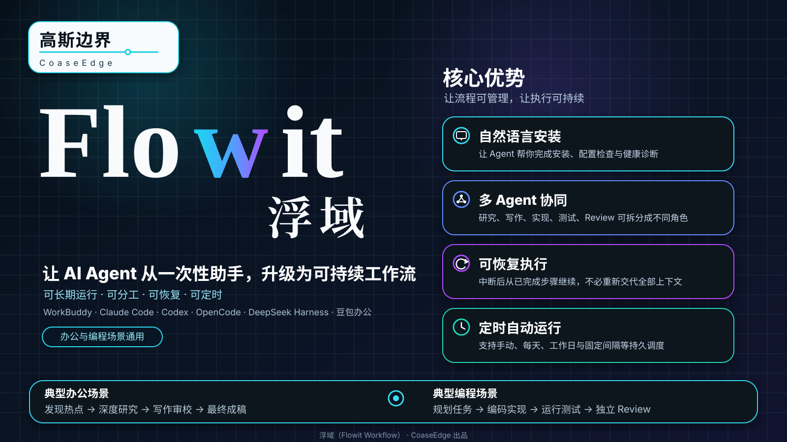

<div align="center">



<br />

[](https://github.com/Andrewlislin/Flowit-Workflow/actions/workflows/ci.yml)
[](LICENSE)
[](package.json)
[](https://github.com/Andrewlislin/Flowit-Workflow/releases/tag/v0.5.0-beta.1)

# 浮域（Flowit Workflow）

**把你已经在使用的 AI Agent，从“一次性助手”变成可长期运行、可分工、可恢复的 AI 工作流。**

**中文（默认）** · [English](README.en.md) · [安装与修复](docs/setup.md) · [现成工作模式](docs/presets.md) · [技术架构](docs/architecture.md)

</div>

---

## 浮域是什么？

WorkBuddy、Claude Code、Codex、OpenCode、DeepSeek Harness、豆包办公等 Agent，本来就很会“做一件事”。

浮域解决的是另一个问题：**怎样让这些 Agent 长期、重复、分步骤地把一套工作稳定做下去。**

单独使用 Agent，通常是：

```text
你
 ↓
Agent
 ↓
做一次任务
 ↓
得到结果
```

加入浮域以后，可以变成：

```text
定时 / 事件 / 手动开始
          ↓
         规划
          ↓
         调研
          ↓
         执行
          ↓
         审核
          ↓
       人工确认
```

浮域负责记住：什么时候运行、哪一个 Session 负责哪一步、需要什么 Skill、哪些上下文可以传递、哪些步骤已经完成、失败以后从哪里恢复。

浮域**不会替代** Agent 自己的模型、登录、权限、沙箱、工作区信任或工具授权。真正执行工作的仍然是你选择的 Agent。

## 什么时候值得用浮域？

如果只是：

- 帮我改一封邮件；
- 总结一个 PDF；
- 解释一个函数；
- 修一个很小的 bug；

直接用 WorkBuddy / Claude Code / Codex 通常更简单。

当任务开始变成下面这些情况时，浮域的价值会明显上升：

- 每天、每周都要重复；
- 要经过多个固定步骤；
- 需要第二轮检查或独立 Review；
- 任务很长，中断以后不能从头再来；
- 不同 Agent 各做自己擅长的部分；
- 希望把一套 Prompt 变成公司或团队可复用的标准流程。

| 单独 Agent | 浮域 + Agent |
| --- | --- |
| “现在帮我做一下” | “以后一直按这个流程做” |
| 一个长 Prompt | 明确的步骤和检查点 |
| 你自己记得什么时候触发 | 可以用持久定时任务触发 |
| 常由一个 Session 从头做到尾 | 可以一个或多个 Session 分工 |
| 中断后可能需要重新解释上下文 | 已完成步骤和运行状态会保留 |
| 流程主要藏在 Prompt 里 | 流程变成可复用工作流 |

一句话判断：

> **AI 帮我做一件事 → 直接用 Agent。**  
> **AI 要长期帮我运营一套工作 → 用浮域。**

## 最简单的开始方式：直接对 Agent 说人话

浮域底层有命令行，但普通用户不需要记命令。对支持 MCP / 原生插件的 Host，最推荐的体验是：**让当前 Agent 帮你安装和管理浮域。**

第一次可以直接对 Agent 说：

> 帮我安装浮域（Flowit Workflow）最新 beta 版，并适配你当前这个 Agent。先检查我的环境和已有配置，不要直接修改。先告诉我准备改哪些文件、增加什么权限，等我确认以后再安装。安装完成后做一次健康检查；如果还有必须在界面里手动完成的步骤，用最简单的话告诉我。

安装好以后继续说：

> 帮我看看浮域现在有哪些工作流。

> 用当前会话给我建一个深度研究。

> 现在运行“认证模块重构”这个工作流。

> 把“行业日报”改成每个工作日上午 8 点运行。

浮域 MCP 已经提供 Session 查询、Pipeline 创建/运行、Schedule 管理和 daemon 启动等能力，所以有工具权限的 Agent 可以把这些自然语言转换成真正的持久工作流操作。

<details>
<summary><strong>高级用户：直接安装 beta</strong></summary>

需要 Node.js `^22.19.0` 或 `>=24.0.0`。

```bash
npx @coaseedge/flowit-workflow@beta setup
```

也可以全局安装后使用 `flowit-workflow setup`。

</details>

## 在不同 Agent 里怎么安装、怎么用

### WorkBuddy：最适合普通办公自动化

第一次直接告诉 WorkBuddy：

> 帮我给当前 WorkBuddy 安装浮域。保留我现有的 MCP、Skill 和 Hooks，先给我看安装计划，确认以后再执行，最后做健康检查。

浮域会自动完成机器侧的四层连接：

```text
Flowit MCP
+
Bridge Worker Skill
+
WorkBuddy 生命周期 Hooks
+
持久 Bridge 工作目录
```

**WorkBuddy Desktop 目前还需要一个界面操作：**在 WorkBuddy 的自动化/定时任务里，新建一个周期运行 **Flowit Workflow Bridge Worker** 的任务。它可以理解成“收件员”：定期看看浮域有没有新任务，没有就什么也不做。

如果使用 Managed Driver，则不需要这个桌面轮询步骤。

典型使用方式：

> 用浮域给我建一个“行业日报”。每个工作日上午 8 点运行，关注 AI、企业软件和智能办公。先找最新信息，再筛选重要内容，再研究背景，最后做事实检查并生成给管理层看的中文摘要。不要自动发布。

这类工作最适合 **内容工作室**。

### Claude Code：适合技术研究、长文档和大型代码任务

第一次告诉 Claude Code：

> 帮我把浮域安装到当前 Claude Code。不要散改我无关的设置，先给我看安装计划，确认后再装。安装完成后重新加载插件并检查是否正常。

浮域会安装一个相对独立的个人插件目录：

```text
~/.claude/skills/flowit-workflow/
```

其中包含浮域自己的 Skills、Hooks 和 MCP。也支持只安装到当前项目；Claude 自己的 workspace trust / MCP approval 仍然有效，浮域不会绕过。

典型研究场景：

> 用浮域研究“我们是否应该把这个服务迁移到事件驱动架构”。不要只讲好处。先定义问题，再找证据，再专门找反例，最后综合并审核结论里的不确定性。

这类工作最适合 **深度研究**。

典型编程场景：

> 用浮域重构认证模块。不要直接上来就改代码；先分析影响范围和风险，再制定计划，再实现，最后用独立 Review 检查验收标准。

这类工作最适合 **AI 项目小组**。

### Codex：适合实现、测试和代码 Review

第一次告诉 Codex：

> 帮我安装浮域。不要重新格式化或覆盖我的 config.toml，只管理浮域自己的配置；如果发现冲突就停下来告诉我。安装后检查 MCP 是否正常。

浮域只管理 Codex 配置中的 `mcp_servers.flowit-workflow` 区块，其他 TOML 内容、注释和顺序保持在浮域的 ownership 之外。

典型场景：

> 用浮域处理 issue #128。先理解需求和现有代码，再收集实现需要的上下文，再编码和测试，最后单独做 Review。发现阻断问题就明确列出来，最后停下来让我确认，不要自动 merge。

也可以让不同 Codex Session 分工，例如一个负责执行、另一个只负责 Review。

### OpenCode V2：适合已有 OpenCode 开发环境

第一次告诉 OpenCode：

> 帮我安装浮域，不要改我的 model、agent、注释和其他 MCP。安装后检查 OpenCode V2 服务是否可连接；如果没有运行，告诉我该启动什么，不要偷偷帮我启动后台进程。

浮域只修改 JSON/JSONC 里的：

```text
mcp.servers.flowit-workflow
```

并保留 `//` 注释、`/* */` 注释、尾逗号和其他配置。

典型场景：

> 给这个项目建一个每天凌晨运行的代码健康检查。看依赖风险、失败测试、明显技术债和重要 TODO。不要改代码，只生成报告；再用第二个阶段专门质疑第一阶段的结论。

### DeepSeek Harness：适合长期常驻型 Agent 系统

第一次告诉 Harness Agent：

> 帮我安装浮域原生插件。保留现有 Cordis Plugin 和 patch 配置，先给我看计划，确认后再写入，并告诉我是否需要重启 Harness。

用户级安装会使用 Harness 的持久 patch 层；项目级安装因为 Harness 当前没有项目本地持久 patch 层，会生成明确的运行时 overlay。

典型场景：

> 每天早上研究我关注的 20 个开源项目。优先用一手来源，和昨天做对比；发现重大变化时再深入分析。必须找反方证据，最后只输出经过审核的变化摘要，并保留历史。

DSH-only 工作流使用 Harness 内嵌的浮域 Store。当前 DSH 与 root-daemon Host 混在同一个 Preset 里会主动拒绝运行，避免假装这种跨运行时拓扑已经可靠支持。

### 豆包办公：适合 GUI + Bridge 的办公执行场景

豆包办公目前更适合作为浮域的**执行端**，而不是完全自配置的控制台。浮域不宣称豆包存在公开稳定的 Session Resume、Skill 自动安装或 Automation 管理 API。

机器侧安装会准备好 **Flowit Workflow Bridge Worker** Skill 和持久 Bridge 目录。然后用户或管理员需要在豆包办公图形界面完成：

1. 导入/启用 Worker Skill；
2. 只授权它访问浮域 Bridge 目录；
3. 建立一个周期调用 Worker 的豆包原生定时任务。

典型场景：

> 每个工作日下午 5:30，把今天项目资料和会议纪要整理成：已完成、未完成、明天要做、风险。只生成报告，不要自动发给领导。

当前版本里，工作流的创建和管理更适合从另一个已连接浮域 MCP 的 Agent 或部署工具完成，豆包办公负责执行 Bridge 任务。

## 三个现成工作模式

普通用户不需要记 Preset ID。中文产品界面优先展示下面三个名字；稳定技术 ID 仍然兼容。

| 工作模式 | 稳定 ID | 适合 |
| --- | --- | --- |
| **内容工作室** | `content-studio` | 新闻、公众号、行业内容、日报 |
| **深度研究** | `research-lab` | 市场研究、技术研究、竞品、政策分析 |
| **AI 项目小组** | `agent-team` | 编程、方案、复杂多步骤工作 |

### 内容工作室

```text
发现热点
  ↓
选择题目
  ↓
研究资料
  ↓
写作
  ↓
查事实
  ↓
主编审核
```

默认停在人工可审查的最终稿，**不自动发布**。

### 深度研究

```text
规划问题
  ↓
搜证据
  ↓
找反例
  ↓
综合
  ↓
审核
```

强调一手证据、反方证据、不确定性和结论可追溯性。

### AI 项目小组

```text
规划
 ↓
调研
 ↓
执行
 ↓
Review
```

适合编程任务、迁移计划、方案制定和复杂办公任务。

中文名、原英文名和稳定 ID 都可以解析到同一个内置工作模式。

## 直接用自然语言创建工作流

普通用户不应该先学 Pipeline、Node、Adapter、Session ID。先描述“想让 AI 怎么工作”即可。

**办公日报**

> 帮我用浮域建一个工作日早上 8 点运行的行业日报。所有步骤先用当前 WorkBuddy 会话。关注 AI、企业软件和智能办公；研究以后再写，重要事实必须检查，最后只生成一份我能审核的报告。

**每周竞品分析**

> 每周一早上比较 A、B、C 三家公司上周的产品发布、融资、招聘、营销和重大新闻。保留来源，专门找与主流判断相反的证据，最后给我风险、机会和下周继续观察的事情。

**大型编程 Issue**

> 给 issue #128 建一个 AI 项目小组。Claude Code 负责规划，Codex 负责实现，再用另一个 Codex Session 做 Review。不要自动 merge。

**跨 Agent 协作**

> WorkBuddy 负责搜网页和整理材料，Claude Code 负责深入分析，Codex 负责检查技术细节，最后 WorkBuddy 整理管理层报告。先给我看流程，不要直接创建。

浮域的价值就在这里：用户描述“谁负责什么、什么时候做、最后停在哪里”，底层再转换成 Session、Pipeline 和 Schedule。

## 定时也可以直接说人话

内置工作模式支持：

```text
手动运行
每天某个时间
每个工作日某个时间
固定间隔
```

所以用户只需要说：

> 只在我手动叫它的时候运行。

> 每天早上 8 点运行。

> 每个工作日上午 9:30 运行。

> 每两小时检查一次。

日历型 Schedule 使用真实 IANA 时区，并尽量保持用户指定的当地墙上时钟时间。安装工作模式本身不会马上执行 Agent 任务；定时任务的第一次运行仍在未来。

## 重要安全边界

- 浮域不会替代 Host 的登录、权限、沙箱、工作区信任和审批机制。
- Setup 先生成计划再确认；配置冲突、格式错误时默认停止，而不是猜着覆盖。
- 安装工作模式只创建/复用 Pipeline 和可选的未来 Schedule，不会在安装进程里偷偷执行 Agent 工作。
- **内容工作室**默认不向外部平台自动发布。
- 浮域使用 **at-least-once execution（至少一次执行）**，不承诺所有外部副作用天然 exactly-once。发送邮件、发布内容、删除数据、付款、生产部署等高影响动作，应该使用 Host 原生幂等/事务能力，或在真正执行前保留明确的人工确认边界。

## 给开发者：浮域内部怎么工作


Flowit Core 保存的是编排事实和引用；Host Adapter 把这些事实翻译成各 Agent 原生的 Session、Skill、上下文、事件和生命周期操作。

核心能力包括：

- **持久 Schedule**：原子 occurrence claim、worker lease、heartbeat、retry、stale-run recovery；
- **Pipeline / DAG**：持久 admission、节点 checkpoint、兄弟节点隔离、retry、有限去重；
- **Skill binding**：目标 Host 无法建立指定 Skill 时 fail closed；
- **Context graph**：Session 之间传递有限、只读的上下文引用，不复制凭据或权限。

### Host 支持

| Host | 级别 | Dispatch | Skills | Context | Events |
| --- | --- | --- | --- | --- | --- |
| DeepSeek Harness | **Reference** | 原生 live/cold Session | Native | Native snapshot | Native |
| Claude Code | **Pilot** | 公共 `--resume` 路径 | Verified wrapper Skill | Bounded summary | Durable Hooks journal |
| OpenCode V2 | **Experimental** | 官方 V2 SDK API | 官方 V2 Skill API | Bounded Session context | Reconnecting V2 event stream |
| Codex | **Experimental** | App Server v2 thread/turn API | Typed `skill` item | Bounded thread summary | App Server notifications |
| WorkBuddy | **Hybrid** | Bridge 或 managed driver | WorkBuddy Skill | Bounded summary | Hooks/bridge |
| 豆包办公 | **Bridge** | Host Worker | Custom Skill | Bounded summary | 不宣称公开 event API |

### 持久执行语义

```text
观察到触发
   ↓
持久入队 / 原子认领
   ↓
worker lease + heartbeat
   ↓
dispatch / checkpoint / retry
   ↓
完成 → 有界 terminal receipt
失败 → retry 或 dead-letter
```

默认工作流状态存储：

```text
~/.flowit-workflow/instances/<instanceId>/workflow.json
```

更多技术细节见：

- [架构与执行模型](docs/architecture.md)
- [AgentAdapter 契约](docs/adapter-contract.md)
- [Host Adapter 能力](docs/host-adapters.md)
- [Setup / Doctor / Repair / Uninstall](docs/setup.md)
- [Preset / Schedule](docs/presets.md)
- [Bridge protocol v2](integrations/bridge/PROTOCOL.md)
- [中文产品命名说明](docs/zh-CN.md)

## 开发

```bash
pnpm install
pnpm check:supply-chain
pnpm typecheck
pnpm test
pnpm test:host-contracts
pnpm build
```

仓库把经过审查的 lockfile、registry-only 依赖源、严格 TypeScript、package smoke test、恢复/并发测试和 Host contract 测试都作为发布门禁。

## License

使用 [Apache License, Version 2.0](LICENSE)。归属声明见 [`NOTICE`](NOTICE)。

Copyright © 2026 CoaseEdge.
